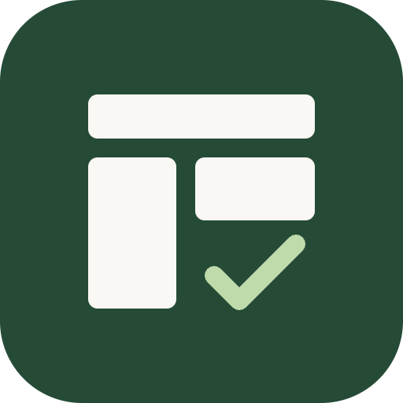
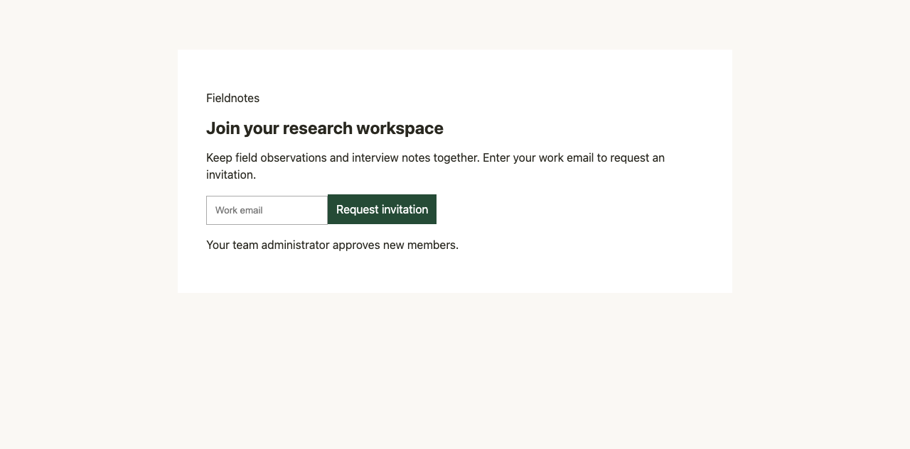
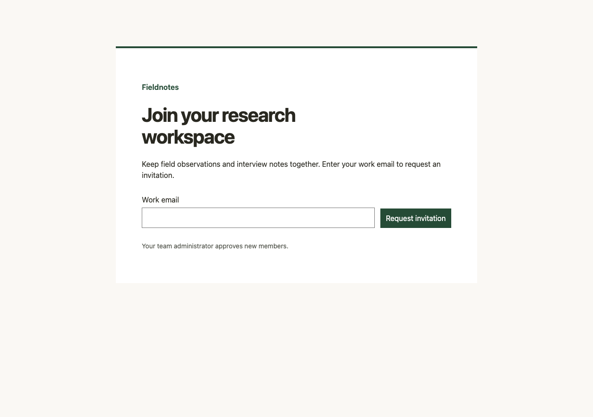

<h1> Design Partner</h1>

Give your coding agent a practical workflow for designing, reviewing, and improving interfaces.

Design Partner helps an agent inspect your product, identify concrete problems, make changes in your existing stack, and verify the result. Use it for a quick UI critique, a focused accessibility repair, a new screen, or a broader redesign.

[Latest release](https://github.com/moinulmoin/design-partner/releases/latest) · [Skill source](skills/design/SKILL.md) · [Changelog](CHANGELOG.md) · [MIT license](LICENSE)

[View on skills.sh](https://skills.sh/moinulmoin/design-partner/design)

```text
$design checkup the billing page; report only
$design a11y fix keyboard navigation in the signup flow
$design refine the dashboard while preserving its layout and brand
```

## What you get

- **19 focused modes.** Choose the work you need, from typography to responsive layout to a complete redesign.
- **Actionable audits.** Findings include evidence, locations, user impact, and concrete corrections.
- **Implementation in your project.** Work with existing components, tokens, and frameworks.
- **Accessibility throughout the workflow.** Address keyboard paths, labels, focus, feedback, motion, and reflow.
- **Clear verification limits.** See what the agent tested and what remains unverified.

The skill is a folder of instructions and references. Your agent supplies the model, file access, and tools. It requires no Command Code installation, Gemini subscription, or dedicated designer subagent. Browser verification depends on the tools available in your agent environment.

## Install

### With the skills CLI

Install from GitHub using the [skills.sh CLI](https://skills.sh/docs/cli):

```sh
npx skills add moinulmoin/design-partner --skill design
```

The CLI lets you choose the target agent and install scope. For a global Codex installation, add `--agent codex --global`. Review or back up an existing `design` skill first; the backup behavior described below belongs to this repository's Python installer, not the skills CLI.

### Claude Code plugin

Add this repository's community-maintained marketplace, then install the plugin:

```text
/plugin marketplace add moinulmoin/design-partner
/plugin install design-partner@design-partner
```

Invoke the namespaced skill with `/design-partner:design checkup the billing page; report only`. This is our repository marketplace, separate from Anthropic's reviewed community catalog. Both Claude manifests pass `claude plugin validate --strict`.

### OpenAI plugin package

The repository includes `.codex-plugin/plugin.json` pointing to the same `skills/` folder. Its package passes the Codex plugin scaffold validator. OpenAI directory review is a separate submission step; no OpenAI directory approval is claimed. Until a listing is published, use the Codex skill installation below.

See [distribution status](DISTRIBUTION.md) for verified installation routes and submission progress.

### Codex: available across your projects

Requires Git and Python 3.9 or newer:

```sh
git clone https://github.com/moinulmoin/design-partner.git
cd design-partner
git checkout v0.1.3
python3 scripts/install.py
```

This installs the skill at `~/.agents/skills/design`. Look for **Design Partner** in the skill picker, or invoke it with `$design`. Start a new session if it does not appear.

**Already have a skill named `design`?** The installer preserves the existing directory in a timestamped backup under `~/.agents/skills/.design-backups/`, then installs the complete new copy. It does not merge local customizations and refuses symlink destinations. The backup location is printed after installation.

### Install for one project

From this repository checkout, provide the target project path:

```sh
python3 scripts/install.py --destination /path/to/project/.agents/skills/design
```

Backups are stored beside that installation in `.design-backups/`. Choose a user-level or project-level installation deliberately; keeping duplicate copies makes updates harder to track.

### Other agents or manual installation

Copy the complete [`skills/design`](skills/design) folder into the skill directory supported by your agent. You can also download `design-skill.zip` from the [release page](https://github.com/moinulmoin/design-partner/releases/latest). Back up an existing installation before replacing it manually.

The instructions are portable, but discovery, invocation syntax, and tools vary by host. The recorded evaluation used Codex; compatibility with other agents has not been systematically tested.

## Start with a specific task

A useful request names the surface, the desired change, and what should stay intact:

```text
$design responsive fix the invoice table at narrow widths.
Keep every column accessible and preserve sorting and selection.
```

For a first pass on an unfamiliar project, start with an audit:

```text
$design checkup the account settings flow; report only
```

Then request implementation based on its findings:

```text
$design a11y fix the confirmed keyboard and form-label issues
from the checkup report. Preserve the existing visual direction.
```

For new work, provide the product and user task:

```text
$design create an invoice detail screen for a freelance bookkeeper.
Show payment status, line items, and a clear send-reminder action.
Use the project's existing components and tokens.
```

Use `$design help` to see the modes. The skill also recognizes `/design` wording once loaded; whether slash syntax invokes it directly depends on your host application.

## Choose a mode

| Mode | Use it to… |
|---|---|
| `checkup` | Get a concise health scan with prioritized findings. |
| `smell` | Identify generic templates, arbitrary styling, and weak product identity. |
| `review` | Get a deeper critique of the experience, systems, and task flow. |
| `a11y` | Repair access barriers across the requested flow. |
| `deslop` | Replace confirmed generic patterns with product-specific decisions. |
| `typeset` | Improve typography, wrapping, rhythm, and hierarchy. |
| `recolor` | Improve palette roles, contrast, themes, and state colors. |
| `motion` | Make animation purposeful, interruptible, and respectful of reduced motion. |
| `interaction` | Complete control states, feedback, forms, overlays, and recovery. |
| `relayout` | Reorganize information and spatial composition. |
| `responsive` | Adapt the interface across widths, zoom, and input contexts. |
| `create` | Build a new surface around a concrete user task. |
| `redesign` | Change the visual direction while preserving required behavior. |
| `tokenize` | Extract repeated decisions into tokens and reusable components. |
| `setup` | Create or update the project's design brief. |
| `finish` | Address visible incompleteness and edge states before shipping. |
| `refine` | Polish hierarchy, spacing, density, and character within the existing direction. |
| `voice` | Strengthen brand expression, copy tone, and imagery. |
| `surface` | Harden application UI for real data, permissions, latency, and failure. |

See the [mode contracts](skills/design/references/modes.md) for details.

## What happens when you run it

The agent reads the relevant instructions, inspects your project and any existing design reports, and works within the requested scope. It uses project evidence to guide decisions and runs the checks its environment supports.

**`checkup`, `smell`, and `review` are report-only** unless you also ask for fixes. They write `.design/<mode>-report.md` in the target project. An HTML mirror is optional when useful or requested. `setup` writes `.design/brief.md` and does not redesign the product on its own.

Implementation modes change project files and consult relevant earlier reports. A bare `$design`, with no mode or target, can proceed into implementation: it selects fixes for an existing interface or creates a minimal interface in an empty project. Use an explicit audit mode when you want findings first.

Reports distinguish HIGH, MEDIUM, and LOW findings. Their verdicts are **Block**, **Needs changes**, **Approve**, or **Verdict pending verification** when missing evidence prevents approval. A passed static check alone does not establish that an interface works in a browser.

## See an example

The repository includes a small runnable signup example covering an audit, accessibility repair, and visual refinement:

| Original | After refinement |
|---|---|
|  |  |

In the recorded browser pass, the original action was unreachable through Tab navigation and the page overflowed at 320px. The repaired versions supported keyboard submission, fit the narrow viewport, and returned zero axe violations.

[Read the evaluation and its limits](evaluations/2026-09-06.md), or open the [original](evaluations/signup/before.html), [accessible](evaluations/signup/accessible.html), and [refined](evaluations/signup/refined.html) HTML files locally. The example simulates submission; it sends no email.

This was a self-run smoke test on a constructed fixture. It does not establish independent model reliability, production readiness, screen-reader coverage, or superiority over another design tool. Design quality still depends on the model, project context, references, and verification tools available.

## Update or restore

Installed copies do not update automatically. In your repository checkout, fetch releases, inspect the release you want, and install that version:

```sh
git fetch origin --tags
git checkout v0.1.3
python3 scripts/install.py
```

Replace `v0.1.3` with the desired published tag. If you installed for one project, pass the same `--destination` again. Preserve any edits in the repository checkout before switching versions.

To restore an installation, move the current `design` directory aside, then move the chosen timestamped backup into its place as `design`. Your prior files are retained in the backup, including local customizations.

## Contribute

The maintained source is [`skills/design/`](skills/design). Improvements are especially useful when they come with a concrete example: the request, relevant UI context, expected behavior, observed result, and what was actually verified.

For local development:

```sh
python3 -m venv .venv
source .venv/bin/activate
python3 -m pip install -r requirements-dev.txt
python3 scripts/validate.py
python3 -m unittest discover -s tests
git diff --check
```

The checks cover package structure, YAML, local reference links, and installer behavior. For workflow changes, also exercise a relevant interface and record the result. Keep private application code, screenshots, and customer data out of public examples.

Record user-visible changes in [CHANGELOG.md](CHANGELOG.md). Releases use patch versions for corrections, minor versions for compatible additions, and major versions for breaking invocation or report changes.

## Origins and license

Maintained by Moinul Moin; OpenAI plugin publisher: Ideaplexa LLC. See the [privacy notice](PRIVACY.md) and [usage terms](TERMS.md).

Design Partner was informed by inspecting Command Code's bundled design workflow, then condensed and rewritten into a standalone skill. It is not an official integration, an exact replica, or a clean-room implementation. The inspected package was marked `UNLICENSED`; the source history and unresolved review limits are documented in [PROVENANCE.md](PROVENANCE.md).

The [MIT license](LICENSE) applies to contributions the contributors have the right to license. It does not grant rights to third-party material.
