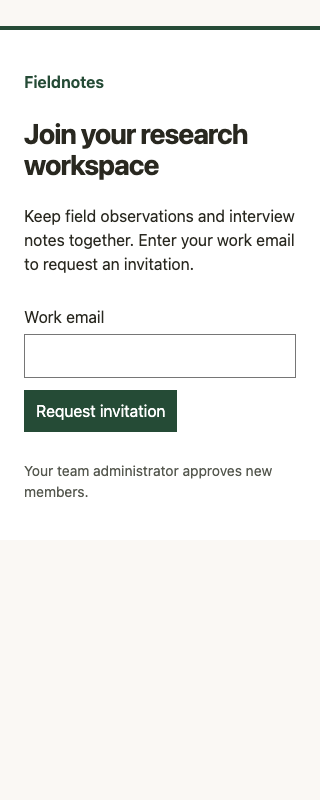

# v0.1.1 smoke evaluation

Executed by the maintaining Codex agent (GPT-6) on 2026-09-06 with agent-browser 0.36.0, Chromium, and embedded axe-core 4.12.1. This is a self-run evaluation on a constructed, runnable signup fixture; it is not a blinded agent test, production-app evaluation, or comparison with other design tools.

## Tasks and observations

1. **Checkup, report only.** Applied the audit protocol to [before.html](signup/before.html) and wrote [the report](signup/.design/checkup-report.md). Tab reached the input, then body, skipping the clickable div. At 320px, document scroll width was 780px. The original HTML remained unchanged throughout the pass and subsequent experiments: SHA-256 `5e31b7df408b25ce420ddab5223522c9d51ecf35bdd65a6a590fe1d6cbcadbea`.
2. **Accessibility repair.** Applied the findings to a separate [accessible.html](signup/accessible.html): native form/button, visible label, email input semantics, visible focus, status feedback, and fluid sizing. Tab → type email → Tab → Enter reached the button and produced “Invitation requested.” Focus computed as a solid outline. At 320px, scroll width equaled 320px. Axe: 0 violations, 0 incomplete, 26 passes.
3. **Visual refinement.** Applied `refine` to [refined.html](signup/refined.html), keeping content, brand colors, and form behavior. Improved heading hierarchy, spacing, and grouping. Inspected screenshots at 320×800 and 1280×900. Mobile content and action fit; desktop form alignment and heading wrapping were coherent. Keyboard submission still succeeded; axe again returned 0 violations, 0 incomplete, 26 passes.

## Reproduce

Open each HTML file locally in a browser. Tab through the page and submit a valid email. Resize to 320px and compare document width with viewport width. Run axe using your available browser tooling. The invitation result is a local simulation; no email is sent and no data leaves the page.

## Evidence

## Limits

Not tested: screen-reader speech, native 200% browser zoom, other browser engines, production integrations, or independent model adherence. No motion exists in this fixture. The audit-boundary result demonstrates this maintaining agent's behavior in one pass, not general reliability. Visual improvement is a reviewer judgment, not a benchmark score. Broader real-project evaluation remains outstanding.
